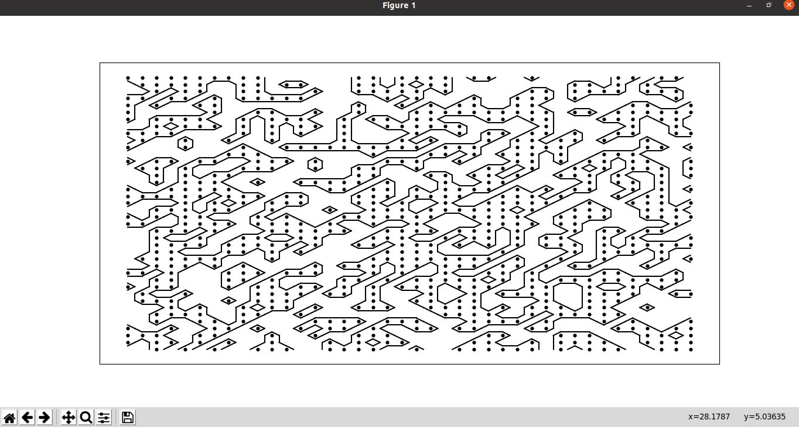
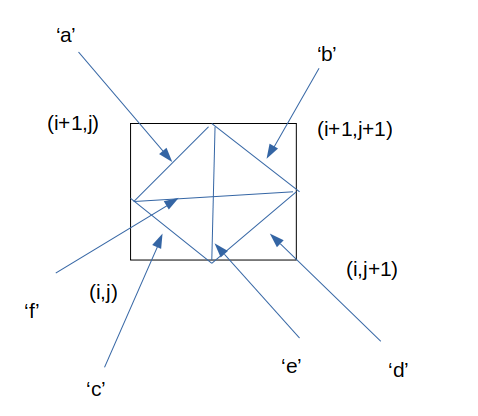

# Marching Square Algorithm




Marching squares is a computer graphics algorithm that generates contours for a two-dimensional scalar field (rectangular array of individual numerical values).It is used in cave generation .The algorihm is implemented using python and matplotlib library
## Following links provides more information about the algorithm
-[ckcollab](https://ckcollab.com/2020/11/08/Marching-Squares-Algorithm.html)

-[wiki](https://en.wikipedia.org/wiki/Marching_squares)


```python 
def get_coord(char,i,j):
```
function takes a char as an input,along with the x and y coordinate of bottom left corner.All the different cases of [lookup table contour lines](https://upload.wikimedia.org/wikipedia/commons/thumb/0/00/Marching_squares_algorithm.svg/757px-Marching_squares_algorithm.svg.png) can be made by selection of 6 lines.these lines are denoted by char which is passed in get_coord function.
These are-




